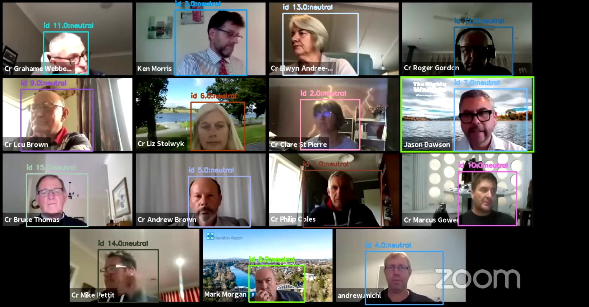

<!-- Improved compatibility of back to top link: See: https://github.com/othneildrew/Best-README-Template/pull/73 -->
<a name="readme-top"></a>
<!--
*** Thanks for checking out the Best-README-Template. If you have a suggestion
*** that would make this better, please fork the repo and create a pull request
*** or simply open an issue with the tag "enhancement".
*** Don't forget to give the project a star!
*** Thanks again! Now go create something AMAZING! :D
-->


<!-- PROJECT SHIELDS -->
<!--
*** I'm using markdown "reference style" links for readability.
*** Reference links are enclosed in brackets [ ] instead of parentheses ( ).
*** See the bottom of this document for the declaration of the reference variables
*** for contributors-url, forks-url, etc. This is an optional, concise syntax you may use.
*** https://www.markdownguide.org/basic-syntax/#reference-style-links
-->

<!-- PROJECT LOGO -->
<br />
<div align="center">
  <a href="https://github.com/github_username/repo_name">
    
  </a>

<h3 align="center">Video facial sentiment analysis</h3>

  <p align="center">
    This project attempts to process a zoom video recordings and output the sentiment and identity of each individual in the video through time
  </p>
</div>


### Built With

* [[Tensorflow]][tensorflow-url]
* [[Deepface]][deepface-url]
* [[Yolo]][yolo-url]

NOTE: the notebooks folder is just the notebooks created during the experimentation process with different model settings.

<!-- GETTING STARTED -->
## Installation

The following explains how to setup the project locally.

Clone this repo into your system.
Open the terminal and show them how to 
First you have to create a python environment with Python version: 3.9.16.
Then you would install the libraries in the requirements.txt file using the folowing command:

1. Clone the repo
   ```sh
   git clone https://github.com/Sawaiz8/Real-time-facial-sentiment-analysis.git
   ```
2. Install pip packages
  ```sh
    pip install -r requirements.txt
  ```

<!-- USAGE EXAMPLES -->
## Usage
**--video_path:** send the video path as argument \\

**--output_path:** send the output folder path

**--show_video:** if set to 1 then it will show the processed video stream. if set to 0 it will save the stream into the video file. default value is 1
Run the following command: 
```sh
  python3 main.py --video_path experimentation_videos/videoplayback.mp4 --output_path model_output --show_video_only 0
   ```

<!-- LICENSE -->
## License
Distributed under the MIT License. See `LICENSE.txt` for more information.


<!-- MARKDOWN LINKS & IMAGES -->
<!-- https://www.markdownguide.org/basic-syntax/#reference-style-links -->
[tensorflow-url]: https://www.tensorflow.org/
[deepface-url]: https://github.com/serengil/deepface
[yolo-url]: https://www.ultralytics.com/
